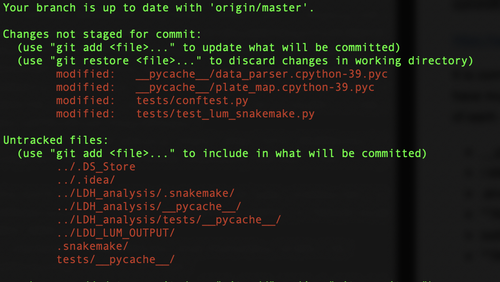

# Creating a .gitignore file

Purpose: get rid of annoying suggestions to git commit and avoid committing files which shouldn't be committed.

[https://www.atlassian.com/git/tutorials/saving-changes/gitignore](https://www.atlassian.com/git/tutorials/saving-changes/gitignore)

.gitignore is the solution for ignoring files and folders that you don't want to be added to your remote repos. A .gitignore file can be created by `vim .gitignore` in the home directory of your repo.

These files ignore lines with # and try to match patterns to the other ones. This is described towards the bottom.

#### Useful commands:

* .* - ignore all hidden files
* **/\_\_pycache\_\_/ - ignore all \_\_pycache\_\_ directories

*git is smart and will analyze local .gitignore files, so you don't have to upload it to your repo directly,* **but this helps all users of the repo to avoid pushing things they shouldn't.** Anything being tracked by .gitignore will have to be removed manually (multiple times if someone keeps committing it).

#### How does it work?

It is common practice for the .gitignore file to be in the root directory, but you can have multiple. Paths and searches are relevant to the location of each .gitignore. Honestly, the table from [atlassian](https://www.atlassian.com/git/tutorials/saving-changes/gitignore) probably has any use case you would need.

* \_\_pycache__/ - matches folders and all contents
* /.idea/ - '/' prefix means only from the root directory
* .snakemake - matches folders and files
* \*\*/tests/ - \*\* match anywhere in the directory 
* out\*/ - matches out/ outv1/ out7b/
* \*\*/tests/out\*/ - match any /tests/out*/